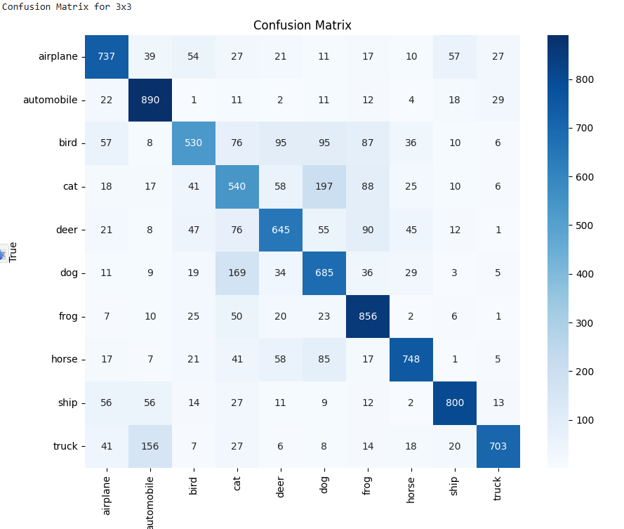

# Домашнее задание к уроку 4: Сверточные сети

## Цель задания
Сравнить эффективность сверточных и полносвязных сетей на задачах компьютерного зрения, изучить преимущества CNN архитектур.

## Задание 1: Сравнение CNN и полносвязных сетей (40 баллов)

Создайте файл `homework_cnn_vs_fc_comparison.py`:

### 1.1 Сравнение на MNIST (20 баллов)
```python
# Сравните производительность на MNIST:
# - Полносвязная сеть (3-4 слоя)
# - Простая CNN (2-3 conv слоя)
# - CNN с Residual Block
# 
# Для каждого варианта:
# - Обучите модель с одинаковыми гиперпараметрами
# - Сравните точность на train и test множествах
# - Измерьте время обучения и инференса
# - Визуализируйте кривые обучения
# - Проанализируйте количество параметров
```

### Графики Accuracy

### Анализ результатов

1. **ResNet CNN** показал лучшую тестовую точность (99.51%) при самом маленьком количестве параметров.
2. Полносвязная сеть значительно проигрывает сверточным архитектурам по обобщающей способности, несмотря на 9-кратное большее количество параметров.
3. Простая CNN почти не уступает ResNet, но при большем числе параметров.
4. Время обучения ResNet оказалось наибольшим из-за дополнительных BatchNorm и вычислений в skip-коннектах.
5. На графиках видно, что после ~5-6 эпох все модели выходят на плато по точности.


### 1.2 Сравнение на CIFAR-10 (20 баллов)
```python
# Сравните производительность на CIFAR-10:
# - Полносвязная сеть (глубокая)
# - CNN с Residual блоками
# - CNN с регуляризацией и Residual блоками
# 
# Для каждого варианта:
# - Обучите модель с одинаковыми гиперпараметрами
# - Сравните точность и время обучения
# - Проанализируйте переобучение
# - Визуализируйте confusion matrix
# - Исследуйте градиенты (gradient flow)
```
### Графики Accuracy


### Confusion Matrix

**FCN**


**Simple CNN**


**ResNet CNN**


**ResNet с регуляризацией**


### Анализ результатов

1. **ResNet с регуляризацией** показал максимальную тестовую точность (82.06%) при хорошем переобучении.
2. **ResNet без регуляризации** хороший показатель acc (79.7%), заметно превосходит FCN и Simple CNN.
3. **Полносвязная сеть** показала худшее качество (50% accuracy) и ярко выраженное переобучение.
4. **Simple CNN** лучше FCN, но сильно отстает от ResNet.
5. Confusion Matrix подтверждает, что ResNet лучше всего классифицирует почти все классы.

## Задание 2: Анализ архитектур CNN (30 баллов)


### 2.1 Влияние размера ядра свертки (15 баллов)
```python
# Исследуйте влияние размера ядра свертки:
# - 3x3 ядра
# - 5x5 ядра
# - 7x7 ядра
# - Комбинация разных размеров (1x1 + 3x3)
# 
# Для каждого варианта:
# - Поддерживайте одинаковое количество параметров
# - Сравните точность и время обучения
# - Проанализируйте рецептивные поля
# - Визуализируйте активации первого слоя
```

### Графики Loss и Accuracy


### Confusion Matrix

**3×3**


**5×5**


**7×7**


**1×1 + 3×3**


### Анализ результатов

1. **3×3 ядра** показали наилучшую обобщающую способность (71.3% Test Accuracy).
2. **5×5 ядра** оказались немного хуже по точности, но обучались быстрее.
3. **7×7 ядра** дали худшее качество и самое высокое значение Loss.
4. Комбинация 1×1 + 3×3 оказалась близка по результату к 5×5, но потребовала больше времени на обучение.
5. Confusion Matrix подтверждает снижение качества при увеличении ядра свертки.

### 2.2 Влияние глубины CNN (15 баллов)
```python
# Исследуйте влияние глубины CNN:
# - Неглубокая CNN (2 conv слоя)
# - Средняя CNN (4 conv слоя)
# - Глубокая CNN (6+ conv слоев)
# - CNN с Residual связями
# 
# Для каждого варианта:
# - Сравните точность и время обучения
# - Проанализируйте vanishing/exploding gradients
# - Исследуйте эффективность Residual связей
# - Визуализируйте feature maps
```

### График нормы градиентов


1. **Deep ResNet** показывает наилучшее качество (82.3% Accuracy) и существенно ниже Train Loss.
2. Глубокая CNN без residual связей хоть и имеет больше параметров, но хуже справляется с обучением, видимо, за счет затухания градиентов.
3. Small CNN показывает худший результат.
4. На графике нормы градиентов видно, что **Deep ResNet** демонстрирует постепенное снижение градиентного потока, но без резкого затухания, тогда как у Deep CNN градиенты почти не растут после 3-й эпохи.
- Ни одна из моделей не демонстрирует явного exploding gradients (резкого роста нормы), что говорит о корректной инициализации весов и использовании BatchNorm.
- В совокупности результаты подтверждают: **Residual связи эффективно борются с vanishing gradients**, повышая стабильность обучения и позволяя использовать более глубокую архитектуру без значительных проблем с затуханием.
  
## Задание 3: Кастомные слои и эксперименты (30 баллов)

Создайте файл `homework_custom_layers_experiments.py`:

### 3.1 Реализация кастомных слоев (15 баллов)
```python
# Реализуйте кастомные слои:
# - Кастомный сверточный слой с дополнительной логикой
# - Attention механизм для CNN
# - Кастомная функция активации
# - Кастомный pooling слой
# 
# Для каждого слоя:
# - Реализуйте forward и backward проходы
# - Добавьте параметры если необходимо
# - Протестируйте на простых примерах
# - Сравните с стандартными аналогами
```
### Графики Loss и Accuracy


1. **CustomConvCNN** показал наилучшее качество на тесте (68%), что говорит о пользе learnable-масштабирования активаций.
2. **SE_CNN** и **CustomActivationCNN** также улучшили результат по сравнению с базовой CNN.
3. **LpPoolingCNN** оказался чуть слабее остальных кастомных вариантов, но всё равно лучше SimpleCNN.
4. Базовая SimpleCNN показала худшую точность (54%), что подтверждает пользу дополнительных слоев и модифицированных активаций.
5. Время обучения всех моделей было примерно одинаковым.


### 3.2 Эксперименты с Residual блоками (15 баллов)
```python
# Исследуйте различные варианты Residual блоков:
# - Базовый Residual блок
# - Bottleneck Residual блок
# - Wide Residual блок
# 
# Для каждого варианта:
# - Реализуйте блок с нуля
# - Сравните производительность
# - Проанализируйте количество параметров
# - Исследуйте стабильность обучения
```
### Графики Loss и Accuracy


1. **WideResNet** показал наилучшую точность на тесте (81.5%), подтверждая высокую эффективность увеличенной ширины каналов.
2. **BottleneckResNet** также продемонстрировал высокое качество (80.1%), но потребовал больше времени на обучение из-за сложной архитектуры.
3. **BasicResNet** немного уступил по точности, но обучался быстрее.
4. Графики показывают, что все модели быстро выходят на плато и демонстрируют стабильное снижение Loss.
5. WideResNet достиг лучшего баланса между скоростью обучения и качеством.
