# Домашнее задание к уроку 5: Аугментации и работа с изображениями

## Задание 1: Стандартные аугментации torchvision (15 баллов)

1. Создайте пайплайн стандартных аугментаций torchvision (например, RandomHorizontalFlip, RandomCrop, ColorJitter, RandomRotation, RandomGrayscale).
2. Примените аугментации к 5 изображениям из разных классов (папка train).
3. Визуализируйте:
   - Оригинал
   - Результат применения каждой аугментации отдельно
   - Результат применения всех аугментаций вместе

---

Ниже представлены результаты применения каждой аугментации и всех аугментаций вместе к 5 изображениям из разных классов:
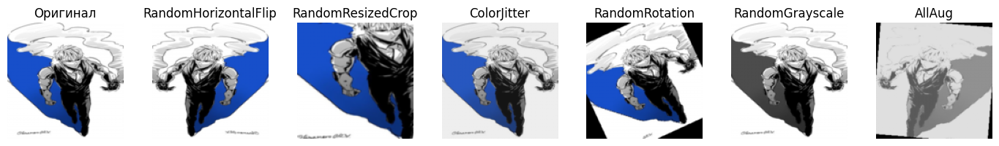
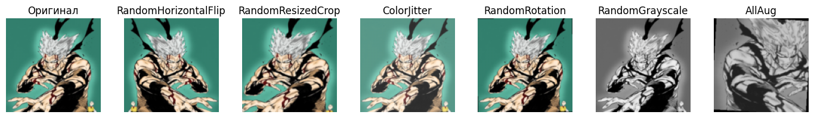
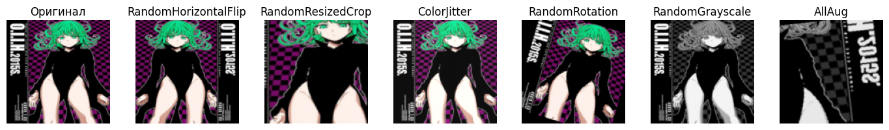
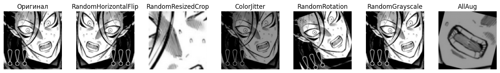
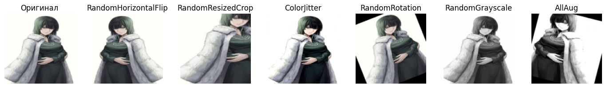

Видна трансформация каждого изображения при отдельной аугментации.

Композиция всех аугментаций значительно изменяет изображение.

---

## Задание 2: Кастомные аугментации (20 баллов)

1. Реализуйте минимум 3 кастомные аугментации (например, случайное размытие, случайная перспектива, случайная яркость/контрастность).
2. Примените их к изображениям из train.
3. Сравните визуально с готовыми аугментациями из extra_augs.py.

---
Были созданы 3 кастомные аугментации

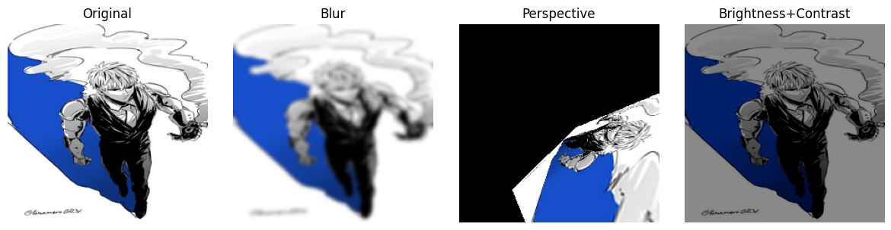
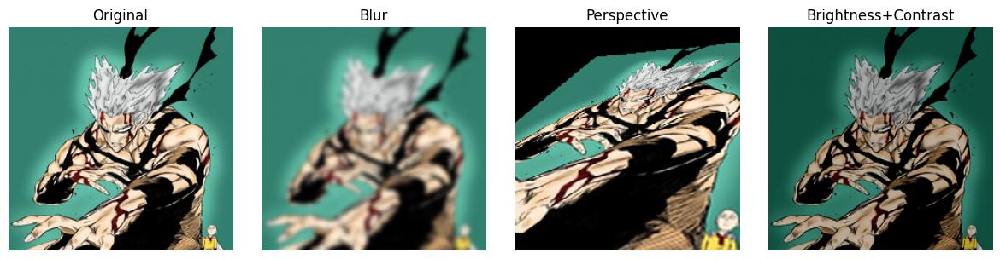
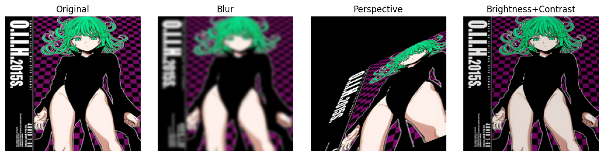
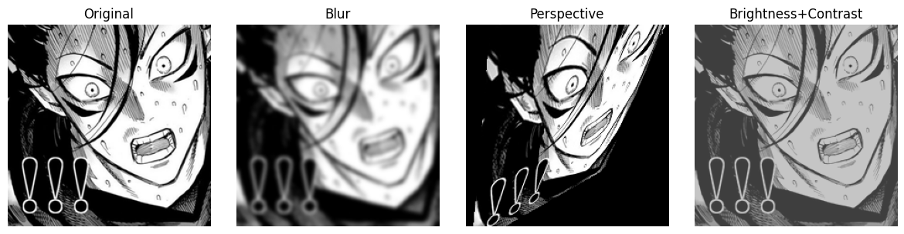
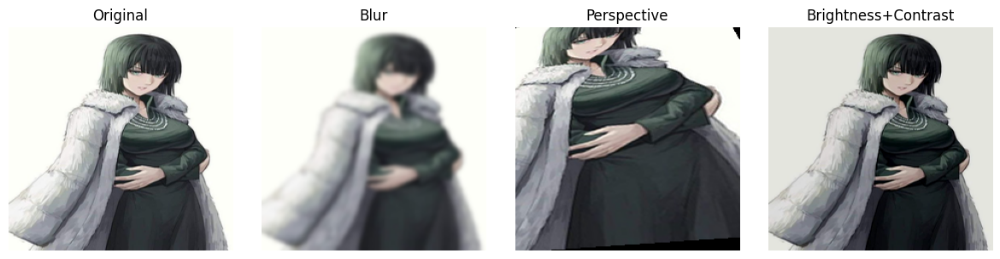

---

## Задание 3: Анализ датасета (10 баллов)

1. Подсчитайте количество изображений в каждом классе.
2. Найдите минимальный, максимальный и средний размеры изображений.
3. Визуализируйте распределение размеров и гистограмму по классам.

---

### Размеры изображений

- Минимальный размер изображения: (210, 240)
- Максимальный размер изображения: (736, 1308)
- Средний размер изображения: 538.9 x 623.6

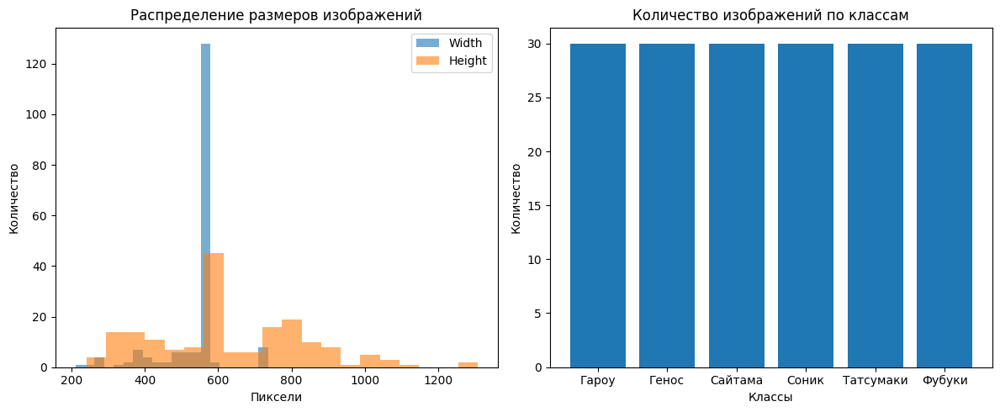

- Все классы представлены равномерно.
- Большинство изображений имеют одинаковый размер (около 600 × 600), но встречаются и сильно отличающиеся — это может повлиять на обучение, если не нормализовать размер.

---

## Задание 4: Pipeline аугментаций (20 баллов)

1. Реализуйте класс AugmentationPipeline с методами:
   - add_augmentation(name, aug)
   - remove_augmentation(name)
   - apply(image)
   - get_augmentations()
2. Создайте несколько конфигураций (light, medium, heavy).
3. Примените каждую конфигурацию к train и сохраните результаты.

---

Реализовал класс AugmentationPipeline с нужными методами

Сохранил результаты в папку augmentations_results

---

## Задание 5: Эксперимент с размерами (10 баллов)

1. Проведите эксперимент с разными размерами изображений (например, 64x64, 128x128, 224x224, 512x512).
2. Для каждого размера измерьте время загрузки и применения аугментаций к 100 изображениям, а также потребление памяти.
3. Постройте графики зависимости времени и памяти от размера.

---

- 64x64: 0.97 сек, 0.17 MB
- 128x128: 1.13 сек, 0.16 MB
- 224x224: 1.44 сек, 0.30 MB
- 512x512: 2.64 сек, 1.52 MB

Визуализация результатов

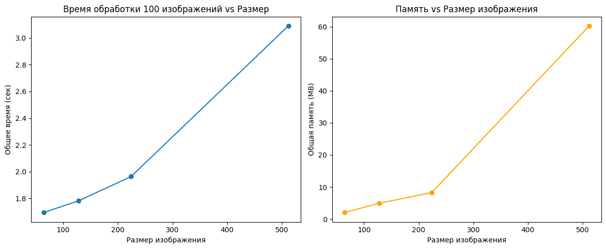

---

## Задание 6: Дообучение предобученных моделей (25 баллов)

1. Возьмите одну из предобученных моделей torchvision (например, resnet18, efficientnet_b0, mobilenet_v3_small).
2. Замените последний слой на количество классов вашего датасета.
3. Дообучите модель на train, проверьте качество на val.
4. Визуализируйте процесс обучения (loss/accuracy).

---
Использовал модель ResNet18, предобученные веса IMAGENET1K_V1, Размер изображений: 224x224, Оптимизатор Adam(lr=0.001), Функция потерь CrossEntropyLoss, обучал 15 эпох.

- Модель быстро обучается на train, достигая точности >99% уже к 10-й эпохе.
- На валидации модель достигает макс. точности 88% на 12 эпохе.
- Переобучение заметно после 10-й эпохи — loss на валидации начинает расти

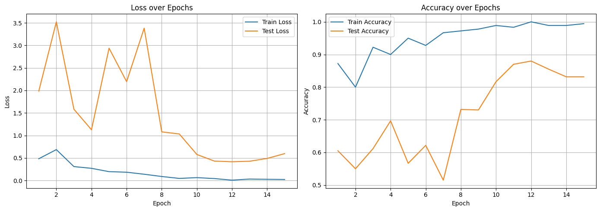

---

